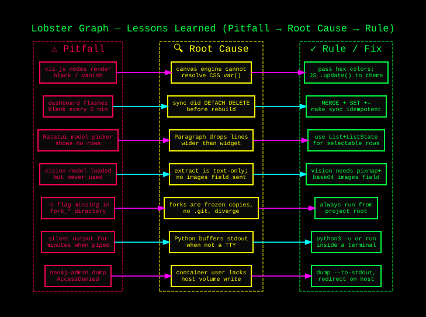

# Lessons Learned — paper_processor



A running log of non-obvious findings, debugging dead-ends, and design decisions worth
remembering. Most recent entries first.

---

## 2026-06-05 — Silent CI Skips due to Missing Dependencies

**What happened:** We added a `pytest` suite for our OCR and markdown parsers to `.github/workflows/lint.yml`, but `test_ocr_fallback.py` and `test_diagram_parser.py` weren't actually running.
**Root cause:** The test files had graceful degradation using `pytest.importorskip("fitz")` and `importorskip("requests")`. Because we forgot to explicitly install `pymupdf` and `requests` in the Ubuntu CI runner, the tests politely skipped execution instead of failing, leading to a "green" hollow build.
**Fix:** Fully mirrored the local runtime environment inside the CI runner including `tesseract-ocr`, `pymupdf`, `requests`, and `Pillow`. Used `pytest -v` to explicitly monitor `SKIPPED` tests.

---

## 2026-06-05 — Path Traversal Sibling Directories via startswith()

**What happened:** We tried to restrict static file serving to a `_processed` directory using `if not target_path.startswith(os.path.realpath(PROCESSED_PATH)): return None`.
**Root cause:** Python's string `startswith` method does not enforce directory boundaries. A sibling directory named `_processed_secret` matches `startswith("_processed")`. This allows trivial path traversal to any adjacent sibling folder.
**Fix:** Always use `os.path.commonpath([base_path, target_path]) == base_path` for boundary containment. 

## 2026-06-04 — HTML5 Canvas Engine Cannot Resolve CSS Variables

**What happened:** We attempted to dynamically style `vis-network` graph nodes by passing CSS variables (`var(--color-concept)`) within the Javascript configuration object.
**Root cause:** `vis-network` uses an HTML5 `<canvas>` to render nodes. When it tries to set `ctx.strokeStyle = "var(--color-concept)"`, the canvas engine fails because it operates independently from the DOM's stylesheet and has no mechanism to resolve CSS variables. It silently fails and defaults to a fallback color (black), completely breaking the visualizer's color tiering.
**Fix:** Passed exact Hex color codes (e.g. `#d500f9`) directly into the `vis-network` configuration. For dynamic switching (like Dark/Light mode), we implemented a toggle function that iterates over the dataset and updates the colors via Javascript rather than relying on CSS overrides.

---

## 2026-06-04 — Idempotent Updates for Background Synchronization 

**What happened:** The web visualization dashboard would occasionally go completely blank and fail to render anything when users reloaded it.
**Root cause:** We set up a background thread to continually ingest new PDFs into Neo4j every 5 minutes. The script started with `session.run("MATCH (n) DETACH DELETE n")` to clear the old graph state before rebuilding. If a user accessed the page during the brief seconds it took to reconstruct the graph, they hit an empty database.
**Fix:** Removed the `DELETE` query entirely. Migrated all `CREATE (p:Paper...)` queries to use `MERGE (p:Paper...) SET p += {...}`. This makes the script strictly idempotent, continuously augmenting the existing database without dropping it, resulting in a flawless experience for active dashboard users.

---

## 2026-05-25 — Ratatui: `Paragraph` Silently Drops Wide Lines — Use `List` for Selectable Rows

**What happened:** `draw_model_picker` in `wizard/src/main.rs` rendered the popup border
and title correctly but showed no model entries inside. Navigation keys worked; pressing
`i` set the picker flag; only the content was invisible.

**Root cause:** `Paragraph::new(lines)` without `.wrap(Wrap { trim: false })` will silently
**discard** any line whose display width exceeds the widget's inner width — it does not
truncate from the right, it drops the entire line. The format string produced ~91-char
lines; the popup inner width was 88 chars. Every model entry was silently eaten.

**Fix:** Replace `Paragraph` with `List::new(items)` + `render_stateful_widget(list, r, &mut state)`
using a `ListState`. This is the idiomatic Ratatui approach for selectable lists and is
already used by the working Scan tab. `highlight_style` + `highlight_symbol("▶ ")` give
the neon selection indicator without manual marker logic. (`a0c47fb`, 2026-05-25)

**Rule:** Use `List` for any selectable row list. Reserve `Paragraph` for static, non-interactive
text that is known to fit within its widget bounds. If you must use `Paragraph` with potentially
long lines, always add `.wrap(Wrap { trim: false })`.

---

## 2026-05-25 — Independent Main/Code Model Selection via pp.py

**What happened:** Added `-c` / `--select-code-model` flag and `--code-model` arg so the
C++ section model can be picked independently of the main model. `pp.py` now shows both
pickers in sequence, then `os.execv`s into `paper_processor.py` with both `--model` and
`--code-model` set.

**Verified live:** `devstral:24b` (main) + `deepseek-coder-v2:16b` (C++) ran correctly on
`2407.13885v1.pdf`. The model swap between sections was confirmed via Ollama `/api/ps`:
devstral unloaded after section 2, deepseek-coder loaded for section 3, devstral reloaded
for section 4.

**Design rule:** Generalise interactive selectors by making the model list a parameter
(`prompt_model_selection(models=KNOWN_GOOD_CODE_MODELS)`). One function, two behaviours,
no code duplication.

**Priority chain for code model:** `forced_code_model → forced_model → CODE_MODEL`  
This means `--model X` still overrides both (old behaviour preserved); `--code-model Y`
overrides only the C++ sections without touching the main model.

---

## 2026-05-25 — Vision Model Was Never Being Used

**What happened:** `gemma4:31b-it-q4_K_M` (a multimodal vision model, ~19 GB) was set as
the `xl_quality` default. The pipeline looked like it was using vision capability but wasn't.

**Root cause:** PDF pages are extracted with `fitz.get_text("text")` — plain text only. All
embedded images, figures, and charts are silently discarded. The Ollama payload only ever
contains `{"model": ..., "prompt": str}` — no `images` field, no base64, nothing multimodal.
The vision weights load into VRAM and sit unused every run.

**Fix:** Replaced `gemma4` with `nemotron-3-nano-30b-small:latest` (text-only, SSM/attention
hybrid). Reclaimed ~6 GB of VRAM headroom.

**Broader rule:** If you're not calling `page.get_pixmap()` and base64-encoding the result
into the Ollama `images` field, you are not using vision — regardless of what model is loaded.
A vision-capable model used text-only is just a larger, slower text model.

**Future option:** To actually exercise vision, switch extraction to:
```python
pix = page.get_pixmap(dpi=150)
image_b64 = base64.b64encode(pix.tobytes("png")).decode()
payload["images"] = [image_b64]
```
Only worthwhile if the model is vision-capable AND the papers contain figures that matter.

---

## 2026-05-25 — Fork Directories Are Frozen Snapshots, Not Branches

**What happened:** Running `python paper_processor.py -s` from inside a `fork_*/` subdirectory
fails with `unrecognized arguments: -s` — the flag doesn't exist in the frozen copy.

**Root cause:** Forks are plain directory copies taken as pre-change snapshots. They have no
`.git`, don't receive updates, and diverge from `main` immediately after creation. They exist
for rollback reference only.

**Rule:** Always run from the project root (`/home/jeb/programs/python_programs/paper_processor/`),
not from a fork subdirectory. Use `./pp.py` or `python3 paper_processor.py` from the root.

---

## 2026-05-25 — Python stdout Buffering Hides Output When Not TTY-Attached

**What happened:** Backgrounding `paper_processor.py` via the Claude Code harness produced an
empty output file for several minutes. `tail -f` showed nothing. The process was running fine.

**Root cause:** Python buffers stdout when not attached to a TTY. Lines only flush when the
buffer fills (~8 KB) or the process exits — so a slow LLM generation produces silence for
minutes before a burst of output appears.

**Fix:** Use `python3 -u` (unbuffered) or run directly inside an `xterm` so it's TTY-attached.
The `xterm -e` approach is cleanest — output streams in real time and signal handling works
correctly.

**Rule:** Any time you want to watch paper_processor live, run it inside a terminal, not
backgrounded:
```bash
xterm -e "python3 -u paper_processor.py --paper foo.pdf --verbose /path/to/docs"
```

---

## 2026-05-25 — `--select-model` / `-s` vs `pp.py` Launcher

**Context:** Added an interactive model picker (`-s` flag) so operators can choose from a
curated list of known-good models at runtime instead of relying on silent page-count
auto-selection.

**Lesson:** A flag-gated feature (`-s`) is easy to forget and awkward to discover. A thin
launcher script (`pp.py`) that always shows the picker is more ergonomic — it makes the
interactive path the default entry point while leaving `paper_processor.py` fully scriptable
for automation.

**Pattern:** Keep the main script non-interactive and flag-driven (good for cron, pipes,
batch). Put interactive UX in a separate launcher that `os.execv`s into the main script.
`os.execv` is preferable to `subprocess` here — it replaces the process cleanly so TTY
attachment, signal handling, and exit codes all work correctly.

---

## 2026-05-14 — text-only Fork (gpt-oss:20b)

**Context:** `fork_gptOSS_textonly_2026-05-14T205304Z/` was created to explicitly swap the
multimodal `gemma4` for `gpt-oss:20b` and document that the pipeline is text-only. This was
the first acknowledgement of the vision waste problem.

**Lesson:** The fork's README clearly stated the pipeline was text-only. That finding was not
propagated back to `main` until 2026-05-25. Write findings in LESSONS_LEARNED (here), not
just fork READMEs, so they survive across the project history.

---

## General — Model Selection Heuristics

| Paper size | Auto-selected tier | Model | VRAM |
|---|---|---|---|
| ≤ 8 pages | `fast` | `deepseek-r1:8b` | ~5 GB |
| ≤ 18 pages | `single` | `deepseek-r1:14b` | ~9 GB |
| > 18 pages | `xl_quality` | `nemotron-3-nano-30b-small` | ~24 GB |
| C++ sections | `xl_code` | `qwen3-coder:30b` | ~17 GB |

Both GPUs (RTX 5080 16 GB + RTX 3080 10 GB, ~26 GB combined) are required for xl-tier models.
Keep `OLLAMA_MAX_LOADED_MODELS=1` when running xl-tier to avoid VRAM contention.

---

## 2026-06-04 — Vis.js Canvas Rendering and CSS Variables

**What happened:** When building the Dark/Light mode toggle for the Neo4j visualization dashboard, the HTML DOM elements (like panels and text) updated colors perfectly using CSS variables, but the actual nodes in the physics graph remained unchanged or disappeared entirely.

**Root cause:** Vis.js renders the physics network using an HTML5 `<canvas>`. The canvas rendering engine completely ignores CSS classes and CSS `var(--color-x)` properties. If you pass a CSS variable into the node definition, it silently fails.

**Fix/Lesson:** Colors in canvas-based libraries must be passed as hardcoded hexadecimal strings (`#FF0000`). To implement theming, the JavaScript toggle function must actively iterate through the dataset, reassign explicit hex values to every node and edge, and call `.update()`.

---

## 2026-06-04 — Idempotent Neo4j Graph Synchronization

**What happened:** We implemented a 5-minute automated background worker in `vram_resident_processor.py` to continuously push newly processed papers into the Neo4j database. Initially, the sync script cleared the database (`DETACH DELETE n`) before rebuilding it. This caused the live web dashboard to flash blank every 5 minutes.

**Lesson:** Background synchronization scripts must be completely idempotent. By rewriting the Cypher queries to use `MERGE` instead of `CREATE` or `DELETE`, the script can safely run repeatedly against the live database. It seamlessly updates existing properties and inserts new nodes without destroying the current layout state, making the live update invisible to the end user.

---

## 2026-06-04 — Dockerized Neo4j Binary Snapshots

**What happened:** We needed a way to safely backup the Neo4j database natively to a `.dump` file. Running `neo4j-admin database dump` requires the database container to be stopped. When we spawned a temporary container to mount the host backup folder and execute the dump, we hit `AccessDeniedException` because the internal `neo4j` user lacked write permissions to the host's volume.

**Lesson:** Bypassing Docker volume permission mappings is easiest using `stdout`. Instead of fighting permissions, we instructed the temporary Neo4j container to dump the binary file directly to `--to-stdout` and used the host's bash shell to redirect that stream into a local file: 
`docker run --rm --volumes-from container neo4j neo4j-admin database dump neo4j --to-stdout > backup.dump`. This flawlessly bypassed volume restrictions.
