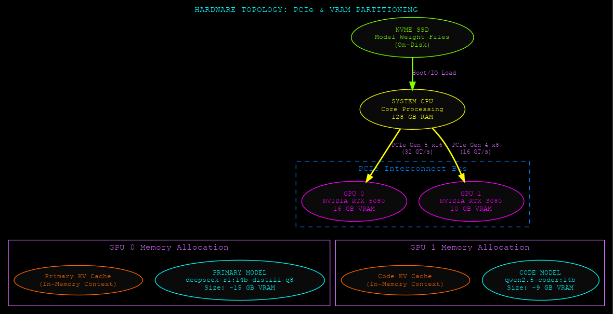
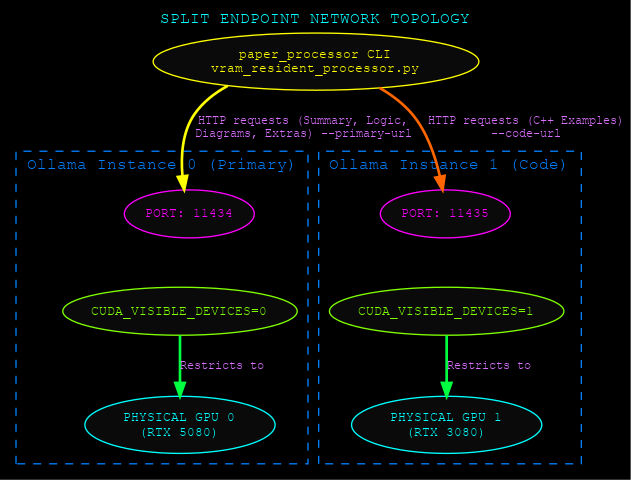
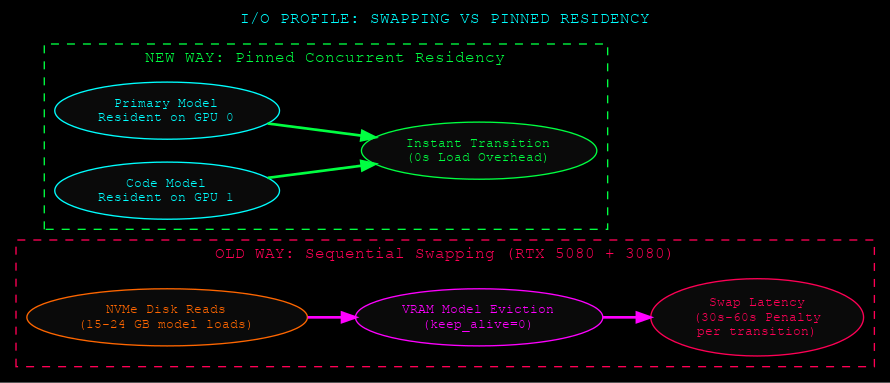
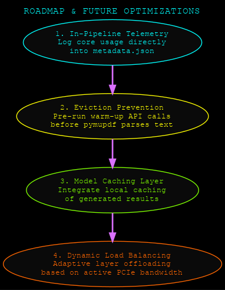

# paper-processor

<p align="center">
  
</p>

A local-first pipeline designed to process a corpus of AI/ML research paper PDFs into structured, high-fidelity study dossiers. It performs text extraction, map-reduce summarization, symbolic logic refactoring,現代 C++ implementation generation, Graphviz diagram parsing, and critical analysis.

This repository includes a specialized **VRAM Concurrent Resident Fork** and a split-instance launcher designed to achieve **Zero-Swap Concurrency** on multi-GPU setups.

---

## Technical Features

* **`paper_processor.py` (Main)**: Sequential single-instance processing.
* **`vram_resident_processor.py` (Concurrent Fork)**: Multi-endpoint routing script optimized to run split model endpoints simultaneously, eliminating VRAM loading churn.
* **`vram_wizard.py` (CLI Wizard)**: Interactive Python terminal dashboard tool to configure directories, endpoints, scope, and launch processes.
* **`telemetry_monitor.py` (Profiler)**: Zero-dependency live CPU, RAM, Disk, and dual-GPU telemetry terminal monitor.
* **`wizard/` (TUI Wizard)**: Rust-based Ratatui terminal dashboard that scans the corpus, configures runs, and streams logs with ANSI syntax highlighting.

Everything runs locally; there is no third-party cloud dependency.

---

## System Diagrams & Architecture

### 1. System Architecture
The Python pipeline coordinates text extraction, chunking, and stage completions, querying Ollama APIs.


### 2. Per-Paper Processing Flow
PDFs are processed through an iterative pipeline. Checking metadata checkpoints ensures resume-on-interruption capability.


### 3. Model Auto-Routing
Page counts pick the model tier. The C++ examples stage runs on a code-specialized candidate.


### 4. Hardware Topology & VRAM Pinned Allocation
In Concurrent Resident mode, GPU resources are isolated. GPU 0 pins the primary reasoning model, and GPU 1 pins the code-generation model, avoiding cross-GPU overhead.


### 5. Split-Instance Network Topology
To enforce physical VRAM isolation, twin Ollama daemons run on separate ports, restricted to single GPUs using `CUDA_VISIBLE_DEVICES`.


### 6. I/O Disk Reads: Swapping vs. Pinned Residency
In standard scheduling, switching between large models triggers high SSD read rates and 30–60 second loading penalties. Concurrent pinning reduces model loading times to **0 seconds** after startup.


### 7. Optimizations Roadmap
roadmap of future enhancements.


---

## VRAM Residency & Swap Optimization

### The Problem
When running large models (e.g. `nemotron-3-nano-30b-small` ~24GB and `qwen3-coder:30b` ~18GB), the combined weight footprint (42 GB) exceeds the workstation's physical VRAM capacity (26 GB). As the pipeline transitions between abstract reasoning and C++ code generation, Ollama evicts the inactive model and reads the target model from disk, introducing a **1–2 minute swap penalty per paper**.

### The Solution: Pinned Concurrency
By sizing down the models to fit concurrently inside VRAM and binding Ollama daemons to specific GPUs, we keep both models resident in memory:
1. **GPU 0 (RTX 5080, 16GB)**: Load `deepseek-r1:14b-qwen-distill-q8_0` (VRAM: ~15 GB) on Port **11434**.
2. **GPU 1 (RTX 3080, 10GB)**: Load `qwen2.5-coder:14b` (VRAM: ~9 GB) on Port **11435**.

---

## Getting Started

### 1. Prerequisites
* **OS**: Linux (Ubuntu 22.04+ recommended)
* **GPU**: Dual-GPU pool (NVIDIA RTX 5080 + RTX 3080 or equivalent)
* **API**: [Ollama](https://ollama.com/) running locally
* **System Packages**: `graphviz` (for diagram rendering)

### 2. Spawning Split Endpoints
To start the isolated, VRAM-locked Ollama daemons:
```bash
chmod +x docs/sessions/2026-06-04T14-03-40_gpu_telemetry/start_isolated_backends.sh
./docs/sessions/2026-06-04T14-03-40_gpu_telemetry/start_isolated_backends.sh
```

### 3. Launching the Interactive CLI Wizard
To configure your run options, pick papers, choose models, and run:
```bash
./vram_wizard.py
```

### 4. Running the Telemetry Monitor
To check GPU core load, temperature, power, and Ollama VRAM allocations in real-time:
```bash
python3 docs/sessions/2026-06-04T14-03-40_gpu_telemetry/telemetry_monitor.py
```
To print an instant hardware snapshot and exit:
```bash
python3 docs/sessions/2026-06-04T14-03-40_gpu_telemetry/telemetry_monitor.py --once
```

---

## CLI Flags (Resident Fork)

```
python vram_resident_processor.py [papers_dir] [flags]
    --primary-url URL      URL of primary reasoning Ollama server (default: port 11434)
    --code-url URL         URL of code-generation Ollama server (default: port 11434)
    --model MODEL          Force a primary model
    --code-model MODEL     Force a code model
    --paper FILENAME       Process a single PDF
    --reprocess SECTION    Force re-running summary|logic|cpp|diagrams|extras|all
    --workers N            Parallel paper workers
    --list                 Print status table and exit
    --override             Force-evict all loaded models on both endpoints
```

---

## Forks Table

| Directory | Feature | Rationale |
|-----------|---------|-----------|
| [`vram_resident_processor.py`](vram_resident_processor.py) | **Zero-Swap Concurrency** | Pinned dual-endpoint routing utilizing GPU 0 (distill-q8_0) and GPU 1 (coder-14b) concurrently. |
| [`fork_2026-05-15T235801Z/`](fork_2026-05-15T235801Z/) | **Performance Optimization** | Configurable context window size, KV cache, and Flash Attention tweaks. |
| [`fork_gptOSS_textonly_2026-05-14T205304Z/`](fork_gptOSS_textonly_2026-05-14T205304Z/) | **Text-Only Gemma Eviction** | Replaces Gemma 31B vision model with text-only `gpt-oss:20b`, saving ~6 GB VRAM. |

---

## License

MIT
