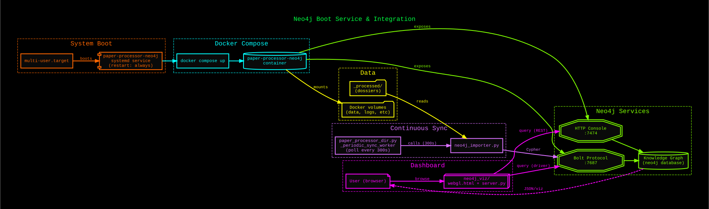
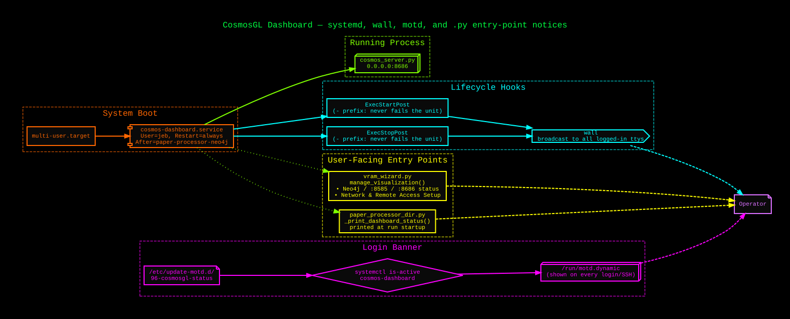

# Architecture


## Overview

paper-processor is a two-component system:

```
┌─────────────────────────┐        ┌──────────────────────────────┐
│   paper-wizard (Rust)   │        │  paper_processor.py (Python)  │
│   Ratatui TUI           │──────▶ │  Pipeline orchestrator         │
│   Tabs: Overview/Scan/  │  exec  │  Reads PDFs → calls Ollama     │
│   Config/Run/Help       │        │  Writes structured dossiers    │
└─────────────────────────┘        └──────────┬───────────────────┘
                                              │ HTTP REST
                                              ▼
                                   ┌──────────────────────┐
                                   │   Ollama (local)      │
                                   │   port 11434          │
                                   │   CUDA_VISIBLE_DEVICES│
                                   │   =0,1 (dual GPU)     │
                                   └──────────────────────┘
```

The wizard is optional — `paper_processor.py` can be called directly from the CLI.

---

## Python pipeline (`paper_processor.py`)

### Entry points

| Path | Purpose |
|------|---------|
| `main()` | Argument parsing, directory scan, worker dispatch |
| `PaperProcessor.process_paper()` | Per-paper orchestration |
| `Backend` | Abstraction over Ollama and OpenClaw HTTP calls |

### PDF extraction and chunking

`fitz` (pymupdf) extracts raw text page-by-page. Papers ≤ 12 pages are sent to
the model in a single call. Papers > 12 pages use a **sliding-window map-reduce**:

1. **Map** — the text is split into overlapping chunks (window = 8 pages,
   stride = 6 pages). Each chunk is summarised independently.
2. **Reduce** — the chunk summaries are concatenated and passed to the model a
   second time to produce a single coherent output.

The overlap (2 pages) prevents important content at chunk boundaries from being
lost between windows.

### Model auto-selection

Models are chosen per paper based on page count, defined in `TIER_BY_PAGES`.
Restricted to two active models for now (2026-08-06 — see
`docs/sessions/2026-08-06_183747_model-tier-restriction-and-100pct-gpu-fit.md`):

| Pages | Tier key | Default model |
|-------|----------|---------------|
| ≤ 35 | `xl_quality` | `gemma4:26b-a4b-it-q4_K_M` (~17 GB, fast/lighter) |
| 36–200 | `xl_reason` | `nemotron3:33b` (~27 GB, strong chain-of-thought) |
| > 200 | `xl_quality` | falls back to gemma4 — stays GPU-resident on huge books |

The C++ section always uses `CODE_MODEL`, which reuses `MODEL_TIERS["xl_quality"]`
(gemma4) rather than a separate code-specialised model — keeps a single model
resident, avoiding VRAM churn from loading a second model for the C++ stage.

`--model` overrides all automatic selection for every section of every paper.
`nemotron3:33b` (~27 GB) exceeds this workstation's combined VRAM (RTX 5080
16 GB + RTX 3080 10 GB ≈ 26.5 GB), so it always runs with some CPU-offloaded
layers — expected, and unrelated to the GPU fit-target tuning below.

### Processing stages

Five stages run per paper in order. Each stage is independent — failure in one
does not block others.

| Stage key | Output file | Prompt focus |
|-----------|-------------|-------------|
| `summary` | `01_summary.md` | Motivation, method, results, limitations |
| `logic` | `02_symbolic_logic.md` | Formal notation, theorems, complexity |
| `cpp` | `03_cpp_examples.md` | C++20/23 implementations (uses CODE_MODEL) |
| `extras` | `04_extras.md` | Open questions, critique, connections |
| `diagrams` | `diagrams/*.dot/.svg` | 6 neon Graphviz diagrams |

The diagram stage calls the model to generate DOT source, then shells out to
`graphviz dot` to render SVG files.

### Metadata checkpointing

Each paper has a `metadata.json` in its output directory:

```json
{
  "slug": "attention-is-all-you-need",
  "source_hash": "sha256:...",
  "model": "gemma4:31b-it-q4_K_M",
  "pages": 15,
  "sections": {
    "summary": {"completed": true, "elapsed_s": 142.3},
    "logic":   {"completed": true, "elapsed_s": 98.1},
    "cpp":     {"completed": false}
  }
}
```

On each run, the pipeline reads `metadata.json` and skips any stage where
`completed: true`. This makes runs **fully resumable** — an interrupted run
continues exactly where it left off.

`--reprocess <stage>` clears that stage's completion flag and forces a re-run
of just that section across all papers.

### Parallelism

`--workers N` controls the number of papers processed simultaneously via a
`ThreadPoolExecutor`. The default is 1 because Ollama's
`OLLAMA_NUM_PARALLEL=1` means concurrent requests queue server-side anyway.
Set `--workers 2` only if you have enough VRAM for two models simultaneously
(requires `OLLAMA_MAX_LOADED_MODELS=2`).

Sections within a single paper run **sequentially** in stage order.

### GPU provisioning (`--override`)

When `--override` is passed, the pipeline calls `_ollama_provision_gpu()` before
starting, which:

1. Lists all models currently resident in VRAM via `/api/ps`.
2. Sends `keep_alive=0` to each to force eviction.
3. Waits up to 20 s for VRAM to clear.
4. If models are still loaded, escalates to `systemctl restart ollama`.
5. Waits a further 15 s for the service to come back clean.

This ensures maximum free VRAM before loading the pipeline's own models.

### Ollama GPU fit-target tuning (host-level, not pipeline code)

Independent of the pipeline's own provisioning above, Ollama's underlying
`llama-server` (0.32.5+) runs its own auto-fit engine (`LLAMA_ARG_FIT`,
default `on`) that decides per-tensor GPU vs. CPU placement — this overrides
the classic `num_gpu` request option entirely when active. By default it
reserves a small safety margin per device (`LLAMA_ARG_FIT_TARGET`) even when
several GB of VRAM sit free, which can leave a model reported as e.g.
`96% GPU` instead of `100% GPU`. This host is configured with
`LLAMA_ARG_FIT_TARGET=0` in `/etc/systemd/system/ollama.service.d/override.conf`
to remove that margin, since the reference dual-GPU setup (RTX 5080 + RTX 3080)
has enough combined headroom for the two active models below their own
VRAM footprint. This is a global Ollama setting, not something
`paper_processor_dir.py` controls — see
`docs/sessions/2026-08-06_183747_model-tier-restriction-and-100pct-gpu-fit.md`
for the investigation and `docs/TROUBLESHOOTING.md` for the symptom/fix.

### Graceful shutdown

SIGINT (Ctrl+C) and SIGTERM set a `threading.Event` (`_shutdown`). The pipeline
checks this flag between sections and after each Ollama streaming chunk. When
set, the current section completes and writes its output, then the run stops
cleanly. A second Ctrl+C forces an immediate `os._exit(1)`.

---

## Rust TUI (`wizard/`)

The wizard is a [Ratatui](https://ratatui.rs/) terminal application compiled to
`paper-wizard`. It communicates with the pipeline by spawning `paper_processor.py`
as a subprocess and streaming its stdout.

### Tab state machine

```
Overview ──▶ Scan ──▶ Config ──▶ Run
                                  │
                              (logs stream here)
```

| Tab | Responsibility |
|-----|---------------|
| Overview | Explains the pipeline stages and output structure |
| Scan | Walks the PDF corpus directory, counts papers and their status |
| Config | Exposes `--backend`, `--model`, `--workers`, `--reprocess` as interactive fields |
| Run | Launches `paper_processor.py` with the configured flags, streams log output with syntax colouring |
| Help | Keybindings reference |

### Search path for `paper_processor.py`

The wizard looks for the Python script in this order:
1. Current working directory
2. Parent of current working directory
3. `~/programs/python_programs/paper_processor/`

### Build

```bash
cd wizard/
cargo build --release
# Binary: wizard/target/release/paper-wizard
sudo ln -sf "$(pwd)/target/release/paper-wizard" /usr/local/bin/paper-wizard
```

---

## Output layout

Per-paper output is **not** a file tree — it's rows in a shared SQLite
database (`paper_store.py`), one consolidated file for every corpus this
machine has ever processed instead of a `_processed/` folder per corpus.
Default location:

```
/mnt/nvme_staging/paper_processor_data/papers.db
```

Overridable via the `PAPER_PROCESSOR_DB` env var or each processor script's
`--db-path` flag. Schema (see `paper_store.py` for the authoritative DDL and
public API):

| Table | Purpose |
|---|---|
| `papers` | One row per paper, keyed by `paper_hash` (content hash of the source PDF) — metadata (`page_count`, `model_used`, `processed_at`, …), `sections_completed` (JSON array), and the 4 markdown sections (`summary_md`, `symbolic_logic_md`, `cpp_examples_md`, `extras_md`) as columns |
| `diagrams` | 0–6 rows per paper (`paper_hash`, `idx`, `title`, `dot_src`, `svg_content`) |
| `ocr_cache` | Per-page OCR text cache, keyed by `(paper_hash, page_idx)` |
| `processing_locks` | Cross-process claim, keyed by `pdf_path` (not `paper_hash` — the hash isn't known until after the PDF is read) |

`paper_hash` is the real identity key: since it's a content hash of the
PDF (not a filename slug), the same paper processed from two different
`papers_dir` locations naturally dedups to one row instead of two separate
file trees.

---

## Neo4j Graph Service

### Purpose

The Neo4j database is the persistent backing store for the Lobster Graph knowledge graph. `neo4j_importer.py` continuously syncs processed dossier metadata into Neo4j as papers finish (every 300 seconds), building a typed graph of papers, concepts, theorems, algorithms, and cross-references. The optional web dashboard (`neo4j_viz/webgl.html`) queries this graph to visualize connectivity, enable interactive exploration, and export subgraph snapshots.

### systemd Configuration

Neo4j runs as a systemd service (`paper-processor-neo4j.service`) that auto-starts on system boot.

| Property | Value |
|----------|-------|
| **Service File** | `/etc/systemd/system/paper-processor-neo4j.service` |
| **Working Directory** | `/home/jeb/programs/python_programs/paper_processor/neo4j_viz/` |
| **Managed by** | Docker Compose |
| **Boot Target** | `multi-user.target` (auto-start on system boot) |
| **Restart Policy** | Always restart on failure (10-second delay) |
| **Memory Cap** | 4 GB |

### Access Points

| Service | Port | Purpose |
|---------|------|---------|
| HTTP Console | `localhost:7474` | Interactive web interface (password auth) |
| Bolt Protocol | `localhost:7687` | Driver connections (used by importer + dashboard) |

### Configuration

**Credentials (development default):**
- User: `neo4j`
- Password: `password123`

See `docs/sessions/2026-08-03_163916.md` ("Future Notes") for security notes on rotating credentials and moving to `.env` files.

**Docker Compose:**
- Location: `neo4j_viz/docker-compose.yml`
- Container name: `paper-processor-neo4j`
- Image: `neo4j:latest` (should be pinned to a specific version in production)
- Volumes: `./data`, `./logs`, `./import`, `./plugins` (persisted across restarts)

### Integration with Pipeline

The `paper_processor_dir.py` main loop runs a background thread (`_periodic_sync_worker`, line 1237) that:
1. Waits 15 seconds after pipeline startup (to let initial papers begin processing).
2. Every 300 seconds, checks if Neo4j Bolt port (7687) is reachable.
3. If reachable, calls `neo4j_importer.py` to sync the `_processed/` directory into the graph.

This means Neo4j does not need to be pre-running; the pipeline will detect when it comes online and begin syncing. However, systemd boot-order ensures Neo4j starts before the pipeline would typically run, so data is available immediately.

### Troubleshooting & History

Full troubleshooting guide: see `docs/TROUBLESHOOTING.md` ("Neo4j container won't start…" and "Permission denied…" sections).

Detailed setup history, lessons learned, and future directions: see `docs/sessions/2026-08-03_163916.md`.

### Architecture Diagram



## CosmosGL Dashboard

`neo4j_viz/cosmos_*` is a second, complementary Neo4j visualization (`@cosmos.gl/graph`) alongside the `webgl.html`/`server.py` one. See the README's "System Diagrams & Architecture" #7–8 for the request/render flow. This section covers how it's kept running and made visible to an operator.

### systemd service

Unit: `/etc/systemd/system/cosmos-dashboard.service`

```ini
[Unit]
Description=Lobster Graph CosmosGL Dashboard (neo4j_viz/cosmos_server.py)
After=network.target paper-processor-neo4j.service
Wants=paper-processor-neo4j.service

[Service]
Type=simple
User=jeb
WorkingDirectory=/home/jeb/programs/python_programs/paper_processor
ExecStart=/home/jeb/programs/python_programs/paper_processor/.venv/bin/python neo4j_viz/cosmos_server.py
Restart=always
RestartSec=5

ExecStartPost=-/usr/bin/wall "CosmosGL dashboard (Lobster Graph) is UP — http://%H:8686"
ExecStopPost=-/usr/bin/wall "CosmosGL dashboard (Lobster Graph) is DOWN (was on port 8686)"

[Install]
WantedBy=multi-user.target
```

Enabled at boot (`systemctl enable --now cosmos-dashboard`), `After=`/`Wants=` on `paper-processor-neo4j.service` so it comes up after the graph database it depends on — but does not hard-fail if Neo4j is briefly unavailable (`cosmos_server.py`'s `/api/graph` just 500s until Neo4j answers). The `-` prefix on the `wall` hooks means a `wall` failure (e.g. a stale pty in `utmp`) never fails the unit itself — confirmed by manual testing, since `wall` reliably logs a harmless `/dev/pts/N: No such file or directory` for dead sessions while still delivering to live ones.

Unlike `neo4j_viz/server.py` (port 8585), which is still started/stopped manually (from `vram_wizard.py` or by hand), `cosmos_server.py` is fully systemd-managed: it survives reboots and restarts automatically on crash.

### Operator visibility (wall / motd / entry-point notices)

Three places surface the service's state so it's never a silent surprise:

1. **`wall` broadcast** — on every start/stop/restart, `ExecStartPost`/`ExecStopPost` broadcast a one-line notice to every logged-in terminal, immediately.
2. **Login banner** — `/etc/update-motd.d/96-cosmosgl-status` runs `systemctl is-active cosmos-dashboard` and prints status + LAN URL on every login/SSH session (same convention as `95-netdata-status`, `96-openclaw-status`).
3. **`.py` entry points** — the two scripts an operator actually runs by hand print a status line so the dashboards aren't a separate thing to remember:
   - `vram_wizard.py` → `manage_visualization()` shows a `CosmosGL Dashboard (8686)` status line alongside the existing Neo4j/8585 ones, and the "Network & Remote Access Setup" submenu now lists both `:8585` and `:8686`.
   - `paper_processor_dir.py` → `_print_dashboard_status()` prints a one-line `Dashboards: webgl.html ... | CosmosGL ...` heads-up right in the run startup banner (best-effort: a 0.3s socket probe / 1s `systemctl` timeout, never blocks or raises if a check hangs).

### Architecture Diagram


