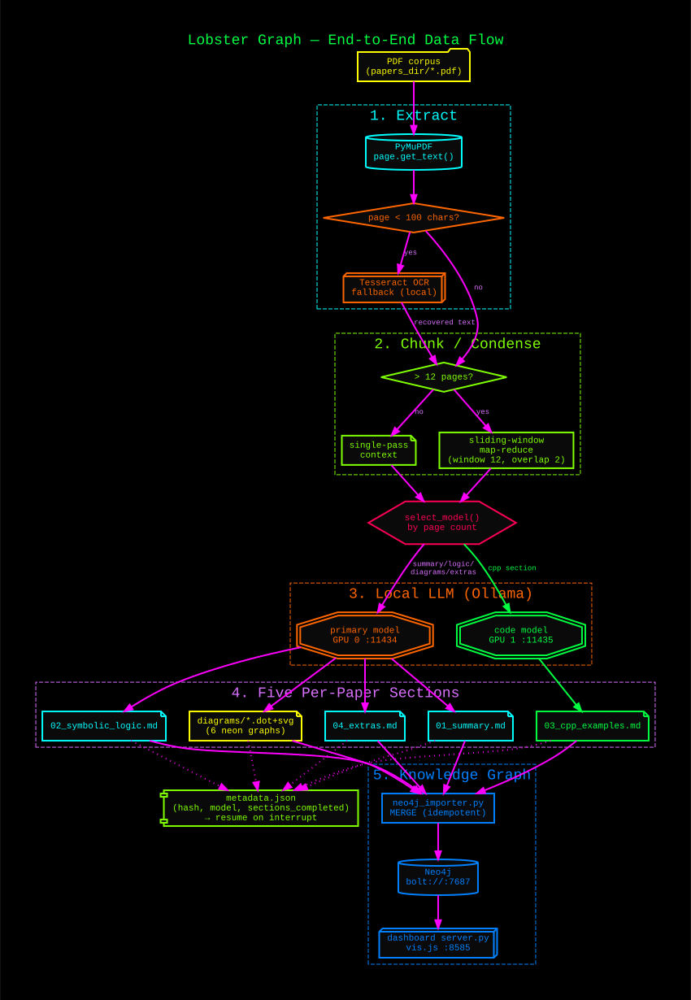

# Architecture



## Overview

paper-processor is a two-component system:

```
┌─────────────────────────┐        ┌──────────────────────────────┐
│   paper-wizard (Rust)   │        │  paper_processor.py (Python)  │
│   Ratatui TUI           │──────▶ │  Pipeline orchestrator         │
│   Tabs: Overview/Scan/  │  exec  │  Reads PDFs → calls Ollama     │
│   Config/Run/Help       │        │  Writes structured dossiers    │
└─────────────────────────┘        └──────────┬───────────────────┘
                                              │ HTTP REST
                                              ▼
                                   ┌──────────────────────┐
                                   │   Ollama (local)      │
                                   │   port 11434          │
                                   │   CUDA_VISIBLE_DEVICES│
                                   │   =0,1 (dual GPU)     │
                                   └──────────────────────┘
```

The wizard is optional — `paper_processor.py` can be called directly from the CLI.

---

## Python pipeline (`paper_processor.py`)

### Entry points

| Path | Purpose |
|------|---------|
| `main()` | Argument parsing, directory scan, worker dispatch |
| `PaperProcessor.process_paper()` | Per-paper orchestration |
| `Backend` | Abstraction over Ollama and OpenClaw HTTP calls |

### PDF extraction and chunking

`fitz` (pymupdf) extracts raw text page-by-page. Papers ≤ 12 pages are sent to
the model in a single call. Papers > 12 pages use a **sliding-window map-reduce**:

1. **Map** — the text is split into overlapping chunks (window = 8 pages,
   stride = 6 pages). Each chunk is summarised independently.
2. **Reduce** — the chunk summaries are concatenated and passed to the model a
   second time to produce a single coherent output.

The overlap (2 pages) prevents important content at chunk boundaries from being
lost between windows.

### Model auto-selection

Models are chosen per paper based on page count, defined in `TIER_BY_PAGES`:

| Pages | Tier key | Default model |
|-------|----------|---------------|
| ≤ 8 | `fast` | `deepseek-r1:8b` (~5 GB) |
| ≤ 18 | `single` | `deepseek-r1:14b` (~9 GB) |
| ≤ 35 | `xl_quality` | `gemma4:31b-it-q4_K_M` (~18 GB) |
| > 35 | `xl_quality` | same (chunking handles context) |

The C++ section always uses `CODE_MODEL` (`qwen3-coder:30b`) regardless of
page count, because code generation benefits from a code-specialised model.

`--model` overrides all automatic selection for every section of every paper.

### Processing stages

Five stages run per paper in order. Each stage is independent — failure in one
does not block others.

| Stage key | Output file | Prompt focus |
|-----------|-------------|-------------|
| `summary` | `01_summary.md` | Motivation, method, results, limitations |
| `logic` | `02_symbolic_logic.md` | Formal notation, theorems, complexity |
| `cpp` | `03_cpp_examples.md` | C++20/23 implementations (uses CODE_MODEL) |
| `extras` | `04_extras.md` | Open questions, critique, connections |
| `diagrams` | `diagrams/*.dot/.svg` | 6 neon Graphviz diagrams |

The diagram stage calls the model to generate DOT source, then shells out to
`graphviz dot` to render SVG files.

### Metadata checkpointing

Each paper has a `metadata.json` in its output directory:

```json
{
  "slug": "attention-is-all-you-need",
  "source_hash": "sha256:...",
  "model": "gemma4:31b-it-q4_K_M",
  "pages": 15,
  "sections": {
    "summary": {"completed": true, "elapsed_s": 142.3},
    "logic":   {"completed": true, "elapsed_s": 98.1},
    "cpp":     {"completed": false}
  }
}
```

On each run, the pipeline reads `metadata.json` and skips any stage where
`completed: true`. This makes runs **fully resumable** — an interrupted run
continues exactly where it left off.

`--reprocess <stage>` clears that stage's completion flag and forces a re-run
of just that section across all papers.

### Parallelism

`--workers N` controls the number of papers processed simultaneously via a
`ThreadPoolExecutor`. The default is 1 because Ollama's
`OLLAMA_NUM_PARALLEL=1` means concurrent requests queue server-side anyway.
Set `--workers 2` only if you have enough VRAM for two models simultaneously
(requires `OLLAMA_MAX_LOADED_MODELS=2`).

Sections within a single paper run **sequentially** in stage order.

### GPU provisioning (`--override`)

When `--override` is passed, the pipeline calls `_ollama_provision_gpu()` before
starting, which:

1. Lists all models currently resident in VRAM via `/api/ps`.
2. Sends `keep_alive=0` to each to force eviction.
3. Waits up to 20 s for VRAM to clear.
4. If models are still loaded, escalates to `systemctl restart ollama`.
5. Waits a further 15 s for the service to come back clean.

This ensures maximum free VRAM before loading the pipeline's own models.

### Graceful shutdown

SIGINT (Ctrl+C) and SIGTERM set a `threading.Event` (`_shutdown`). The pipeline
checks this flag between sections and after each Ollama streaming chunk. When
set, the current section completes and writes its output, then the run stops
cleanly. A second Ctrl+C forces an immediate `os._exit(1)`.

---

## Rust TUI (`wizard/`)

The wizard is a [Ratatui](https://ratatui.rs/) terminal application compiled to
`paper-wizard`. It communicates with the pipeline by spawning `paper_processor.py`
as a subprocess and streaming its stdout.

### Tab state machine

```
Overview ──▶ Scan ──▶ Config ──▶ Run
                                  │
                              (logs stream here)
```

| Tab | Responsibility |
|-----|---------------|
| Overview | Explains the pipeline stages and output structure |
| Scan | Walks the PDF corpus directory, counts papers and their status |
| Config | Exposes `--backend`, `--model`, `--workers`, `--reprocess` as interactive fields |
| Run | Launches `paper_processor.py` with the configured flags, streams log output with syntax colouring |
| Help | Keybindings reference |

### Search path for `paper_processor.py`

The wizard looks for the Python script in this order:
1. Current working directory
2. Parent of current working directory
3. `~/programs/python_programs/paper_processor/`

### Build

```bash
cd wizard/
cargo build --release
# Binary: wizard/target/release/paper-wizard
sudo ln -sf "$(pwd)/target/release/paper-wizard" /usr/local/bin/paper-wizard
```

---

## Output layout

```
_processed/
└── <subfolder>/
    └── <slug>/              # deterministic from PDF filename
        ├── metadata.json
        ├── 01_summary.md
        ├── 02_symbolic_logic.md
        ├── 03_cpp_examples.md
        ├── 04_extras.md
        └── diagrams/
            ├── 01_<title>.dot
            ├── 01_<title>.svg
            └── …  (up to 6 pairs)
```

Slugs are derived from the PDF filename with spaces replaced by hyphens and
special characters stripped. The `source_hash` in `metadata.json` detects if
the source PDF has changed since the dossier was last generated.
