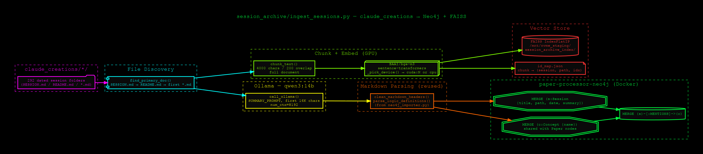
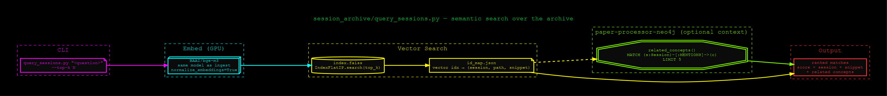

# session_archive

Vector search + knowledge-graph extension over the `claude_creations` engineering
session archive — a companion to the main pipeline's Paper/Concept graph, targeting
this project's own history instead of PDF papers.

Extends the same `paper-processor-neo4j` graph with `Session` nodes (one per dated
`claude_creations` folder) linked to shared `Concept` nodes, and adds a FAISS
vector index so a natural-language question can retrieve the right past session.
See:



## Why it exists

`paper_processor` has no vector/embedding component — retrieval is graph
traversal only. `session_archive` reuses `neo4j_importer.py`'s idempotent
`MERGE`-writer pattern and doc-classifier-gpu's proven chunk/embed approach
(`BAAI/bge-m3`, char-based chunking) to add the missing semantic-search layer,
scoped to this repo's own session logs rather than a new corpus.

## `ingest_sessions.py`

Scans `claude_creations/*/` (one level), reads each folder's primary markdown
(`SESSION.md` → `README.md` → first `*.md`), calls a local Ollama model to
extract a short summary + concept list, chunks the full document text, embeds
each chunk with `bge-m3`, and writes:
- `Session`/`Concept` nodes + `MENTIONS` edges into Neo4j (`bolt://localhost:7687`)
- chunk vectors + an id-map into a FAISS `IndexFlatIP` index

```bash
paper_processor/.venv/bin/python3 session_archive/ingest_sessions.py [options]
```

| Flag | Default | Notes |
|---|---|---|
| `--root` | `~/Documents/claude_creations` | one level of dated folders |
| `--index-dir` | `/mnt/nvme_staging/session_archive_index` | FAISS index + id-map + resume state |
| `--limit N` | none | process at most N *new* folders this run |
| `--folders a,b,c` | none | explicit folder names instead of scanning `--root` |
| `--model` | `qwen3:14b` | Ollama model for summary/concept extraction |
| `--embed-model` | `BAAI/bge-m3` | sentence-transformers model |
| `--chunk-chars` | `4000` | char-based chunk size (200-char overlap) |
| `--reprocess` | off | re-ingest folders already marked done |
| `--save-every N` | `5` | checkpoint interval (folders) |

Resumable: already-ingested folders (tracked in
`<index-dir>/ingested_sessions.json`) are skipped on the next run unless
`--reprocess` is passed. A full run over the archive takes roughly 10–15s per
folder (dominated by the Ollama call).

## `query_sessions.py`

Semantic search over the index built above, with optional related-`Concept`
lookup from Neo4j for extra context.

```bash
paper_processor/.venv/bin/python3 session_archive/query_sessions.py "<question>" [--top-k N] [--no-graph]
```

Prints ranked matches (similarity score, source session + file, a text
snippet, and — unless `--no-graph` is passed — related `Concept` names pulled
from the graph for each matched session).

## Storage

Index artifacts live under `/mnt/nvme_staging/session_archive_index/`
(`index.faiss`, `id_map.json`, `ingested_sessions.json`) — not `/mnt/raid0`,
which is 95% full with zero redundancy (RAID0). This directory only holds
code; nothing here is regenerated data.

## Neo4j schema addition

```
(Session {title, path, slug, date, summary})-[:MENTIONS]->(Concept {name, definition})
```

`Concept` is the same node label `neo4j_importer.py` writes for papers, so a
concept mentioned in both a session and a paper resolves to one shared node —
sessions and papers become cross-linked automatically wherever their concepts
overlap. Both dashboards (`neo4j_viz/cosmos_server.py` on :8686,
`neo4j_viz/server.py` on :8585) query generically by label, so `Session` nodes
render on :8686 without any dashboard changes; :8585 is more Paper-coupled and
won't show them usefully.

## Environment

Runs in `paper_processor/.venv` (extended with `sentence-transformers` and
`faiss-cpu`) — no separate venv, since both scripts also need the `neo4j`
driver already installed there.
